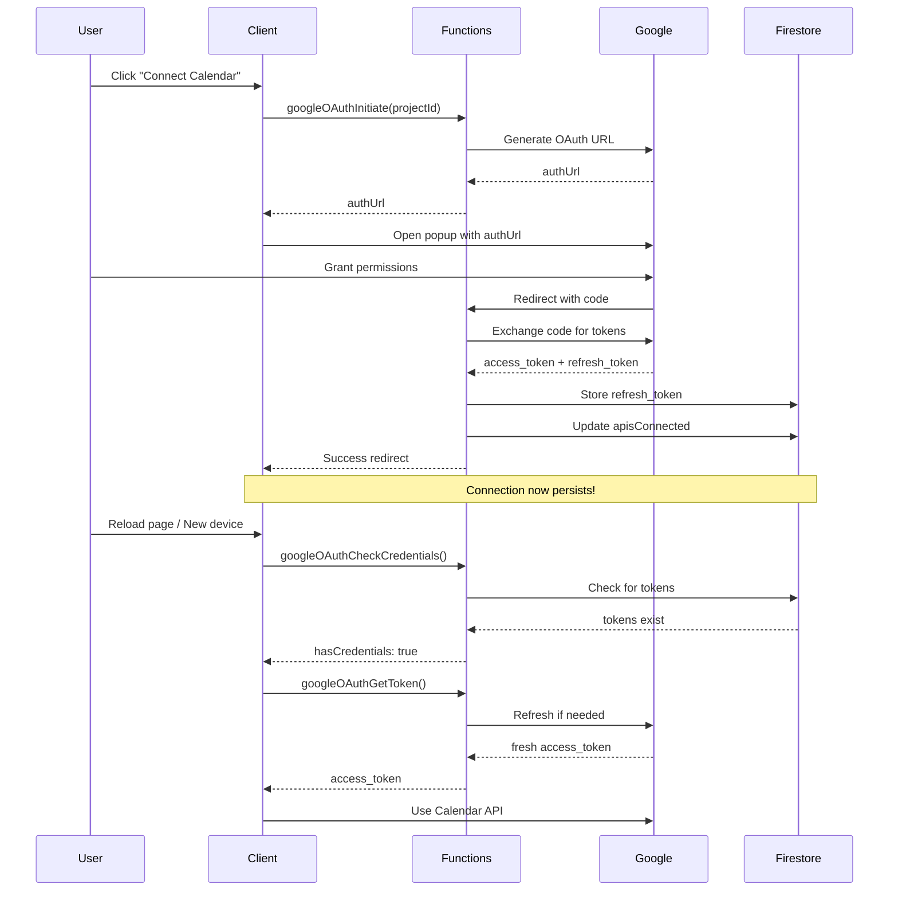

# Google OAuth Server-Side Implementation

## What Changed

The Google Calendar and Gmail OAuth integration has been upgraded from **client-side only** to **server-side OAuth with cross-device persistence**.

### Before

-   OAuth tokens stored in browser memory only
-   Connection lost on page reload
-   Separate authentication required on each device
-   No refresh tokens - required re-authentication frequently

### After

-   OAuth refresh tokens stored securely in Firestore
-   Connection persists across page reloads
-   **Single authentication works on all devices**
-   Automatic token refresh - seamless experience

## Files Added

### Backend (Firebase Functions)

-   `functions/GoogleOAuth/googleOAuthHandler.js` - Server-side OAuth logic
-   Added 5 new Cloud Functions in `functions/index.js`:
    -   `googleOAuthInitiate` - Start OAuth flow
    -   `googleOAuthCallback` - Handle OAuth redirect
    -   `googleOAuthGetToken` - Get fresh access tokens
    -   `googleOAuthRevoke` - Disconnect account
    -   `googleOAuthCheckCredentials` - Check auth status

### Frontend (Client)

-   `apis/google/GoogleOAuthServerSide.ts` - Client-side helper functions
-   Updated `components/.../ConnectCalendar/ActionButton.js` - Use server-side flow
-   Updated `components/.../ConnectCalendar/ConnectCalendarProperty.js` - Check server auth
-   Updated `components/.../ConnectGmail/ActionButton.js` - Use server-side flow
-   Updated `components/.../ConnectGmail/ConnectGmailProperty.js` - Check server auth

### Configuration

-   Updated `functions/envFunctionsHelper.js` - Add OAuth client secret
-   Updated `functions/.env` - Add `GOOGLE_OAUTH_CLIENT_SECRET`

### Documentation

-   `SETUP_GUIDE.md` - Complete setup instructions
-   `FIRESTORE_SECURITY_RULES.md` - Required security rules

## Quick Start

### 1. Get OAuth Client Secret

1. Go to [Google Cloud Console](https://console.cloud.google.com)
2. Navigate to APIs & Services → Credentials
3. Copy your OAuth 2.0 Client Secret

### 2. Configure Environment

```bash
cd functions
echo "GOOGLE_OAUTH_CLIENT_SECRET=your_secret_here" >> .env
```

### 3. Deploy

```bash
# Install dependencies
npm install

# Deploy functions
firebase deploy --only functions
```

### 4. Update Firestore Security Rules

See `FIRESTORE_SECURITY_RULES.md` for required rules.

## How It Works



## Data Storage

### Firestore Structure

```javascript
// Temporary OAuth state (10min TTL)
googleOAuthStates/{state} {
  userId: string,
  projectId: string,
  createdAt: Timestamp,
  expiresAt: Timestamp
}

// User's OAuth credentials (persistent)
users/{userId}/private/googleAuth {
  refreshToken: string,        // Long-lived, server-only
  accessToken: string,          // Short-lived cache
  tokenExpiry: Timestamp,       // When access token expires
  scopes: array,                // Granted scopes
  email: string,                // Google account email
  createdAt: Timestamp,
  lastUsed: Timestamp
}

// Connection status (user can read/write)
users/{userId} {
  apisConnected: {
    [projectId]: {
      calendar: boolean,
      gmail: boolean,
      calendarEmail: string
    }
  }
}
```

## Security

✅ **Refresh tokens** stored server-side only
✅ **Client secret** never exposed to client
✅ **Access tokens** short-lived and auto-refreshed
✅ **CSRF protection** via state parameter
✅ **Firestore rules** prevent token theft
✅ **User isolation** - each user only accesses their tokens

## Migration Notes

**Existing users need to reconnect once:**

1. Old client-side tokens don't persist
2. User sees "disconnected" after page reload
3. Click "Connect" again
4. After reconnecting, works on all devices

**No data loss:**

-   Calendar tasks are preserved
-   User preferences maintained
-   Only OAuth tokens need re-authorization

## Testing Checklist

### Calendar

-   [ ] Connect calendar on desktop
-   [ ] Reload page - verify still connected
-   [ ] Open app on mobile - verify already connected
-   [ ] Sync calendar events - verify working
-   [ ] Disconnect calendar - verify token revoked
-   [ ] Reconnect - verify popup flow works

### Gmail

-   [ ] Connect Gmail on desktop
-   [ ] Reload page - verify still connected
-   [ ] Open app on mobile - verify already connected
-   [ ] Sync Gmail data - verify working
-   [ ] Disconnect Gmail - verify working
-   [ ] Reconnect - verify popup flow works

### Unified OAuth

-   [ ] Connect Calendar - verify Gmail also gets access (single OAuth grants both)
-   [ ] Connect Gmail - verify Calendar also gets access (single OAuth grants both)
-   [ ] Check Firestore for stored tokens at `/users/{uid}/private/googleAuth`
-   [ ] Verify both services work across devices

## Troubleshooting

See `SETUP_GUIDE.md` for detailed troubleshooting.

**Common issues:**

-   OAuth popup blocked → Check browser settings
-   Redirect URI mismatch → Add URIs to Google Cloud Console
-   Permission denied → Deploy Firestore security rules
-   Invalid client secret → Check .env configuration

## Next Steps

1. **Add OAuth client secret** to environment variables
2. **Deploy functions** to staging
3. **Update Firestore rules**
4. **Test on staging** environment
5. **Deploy to production** when validated

## Support

Created for Alldone productivity platform.
For questions, check `SETUP_GUIDE.md` or review function logs in Firebase Console.
